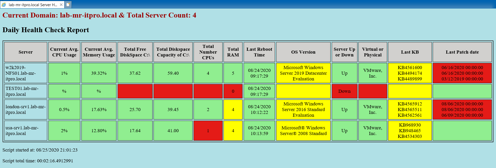

Windows 2008 Servers do NOT report the last Patch date in this script. 

I give credit to Victor Rafael : https://gallery.technet.microsoft.com/scriptcenter/Server-Health-Check-CPU-b34a1379/view/Discussions#content. 
I modified it a lot for my needs. 
I. Remove(s) 
 1. I removed the email parts of the script.... I was not emailing anyone.
 2. I removed serverlist. I need all the windows servers from AD.
 3. I removed a lot of stuff... never the less the script Victor R. did save me a lot time.
 
 II. Add(s) 
 1. I added the total memory  
 2. I added the total Disk space
 3. I added the total CPU count
 4. I added the patching info ...such as patched date & last 3 KBs
 5. I added if server is server virtual or physical
 6. i added if server is pingable for up / down.
 7. I added -ASJOB for each GWMI call cause of the "RPC errors" was hanging this way a time out instead waiting to end actually perform better too. this comes in handy if you have a few thosand servers!!
 8. I added a Total server count for all the servers that in the domain....added it to the HTML too
 9. I added the name of the domain being queried. 
 10. I added a different color of the HTML page
 11. I added a when script time startted  & total time it took to run the script. and also in HTML report. 
